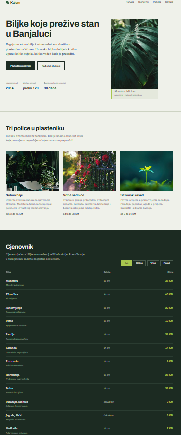
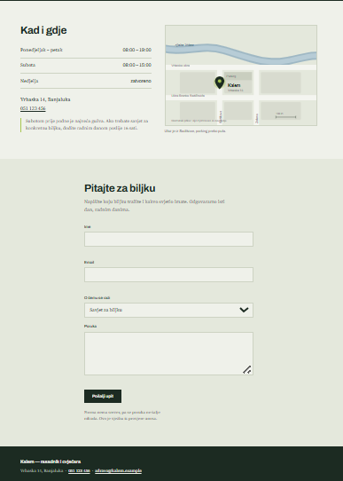
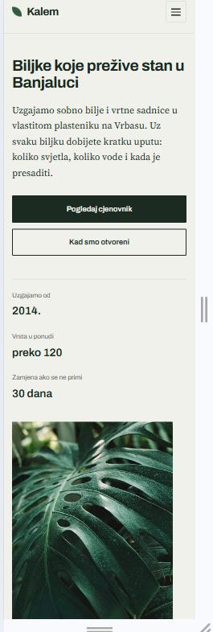
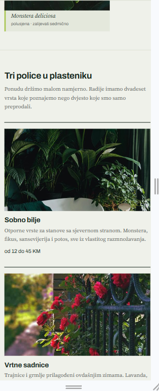
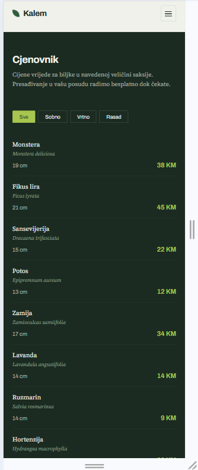
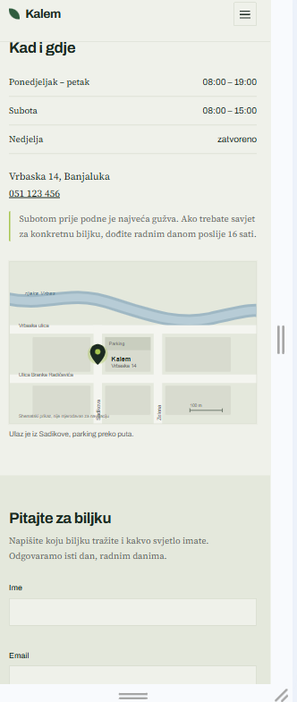
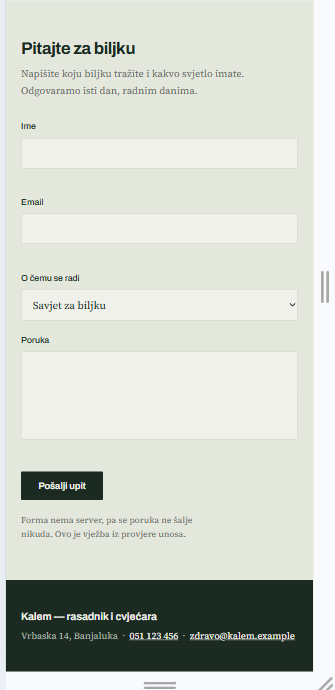

# Kalem — rasadnik i cvjećara

Jednostranični sajt za izmišljeni rasadnik i cvjećaru iz Banjaluke.
Čist HTML, CSS i JavaScript, bez frameworka i bez build koraka.

---

## Šta sajt sadrži

| Sekcija   | Šta je unutra                                             |
| --------- | --------------------------------------------------------- |
| Hero      | Ponuda, dva poziva na akciju i tri činjenice o rasadniku  |
| Ponuda    | Tri kategorije biljaka s ilustracijom i rasponom cijena   |
| Cjenovnik | 12 stavki s latinskim nazivima, filtriranje po kategoriji |
| Posjeta   | Radno vrijeme, adresa i mapa kao statična slika           |
| Kontakt   | Forma bez servera, s provjerom unosa u JavaScriptu        |

---

## Pokretanje

Sajt je statičan i ne treba mu ni server ni instalacija.

**Najbrže:**

1. Skini repo (`Code` → `Download ZIP`) ili ga kloniraj:
   ```
   git clone https://github.com/ItsSelma/KalemSajt.git
   ```
2. Otvori `index.html` dvoklikom.

**Preko lokalnog servera** (ako želiš da putanje rade kao na produkciji):

```
cd kalem
python3 -m http.server 8000
```

Pa otvori `http://localhost:8000` u browseru. Za zaustavljanje: `Ctrl + C`.

Fontovi se učitavaju s Google Fontsa, pa bez interneta stranica koristi
rezervne fontove (Georgia i Arial). Sve ostalo radi offline.

---

## Screenshot

**Desktop (1280 px)**




**Mobitel (390 px)**







---

## Responzivnost

Sajt je upotrebljiv od širine 360 px naviše. Tri prijelomne tačke:

- **iznad 900 px** — hero u dvije kolone, tri kategorije u redu
- **ispod 900 px** — hero se slaže vertikalno
- **ispod 700 px** — meni postaje hamburger, kategorije idu jedna ispod
  druge, a cjenovnik iz tabele prelazi u listu jer tri kolone ne stanu
- **ispod 400 px** — dugmad zauzimaju punu širinu, manji vanjski razmaci

Testirano u DevToolsu na 360, 390, 768, 1024 i 1440 px.

## Brend

**Kalem** je tehnika spajanja dvije biljke u jednu. Ime je odabrano jer
opisuje i posao i odnos s kupcem: biljka koju kupiš nastavlja rasti kod
tebe.
